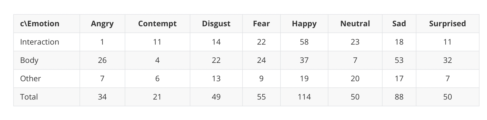
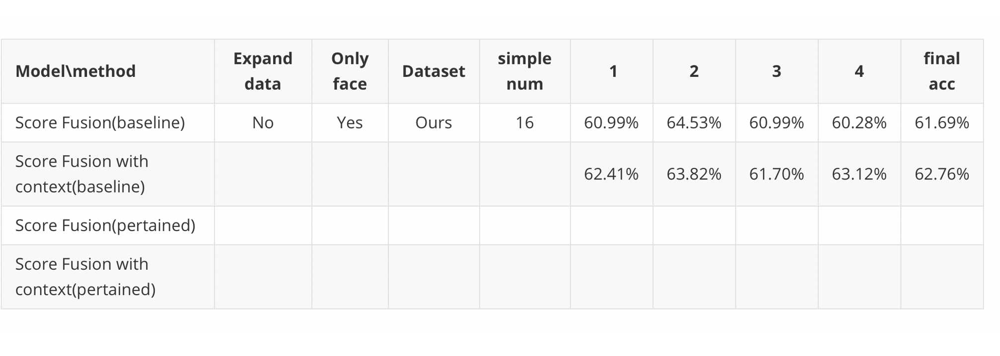
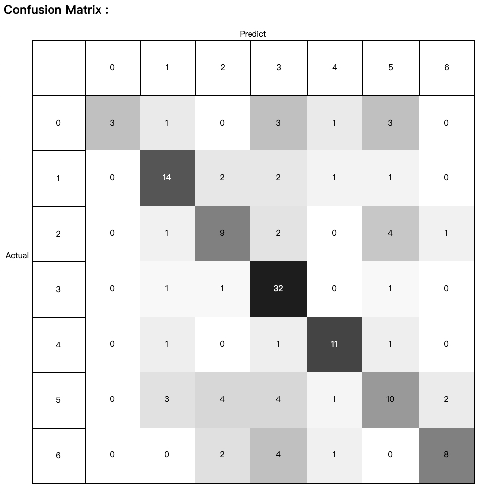
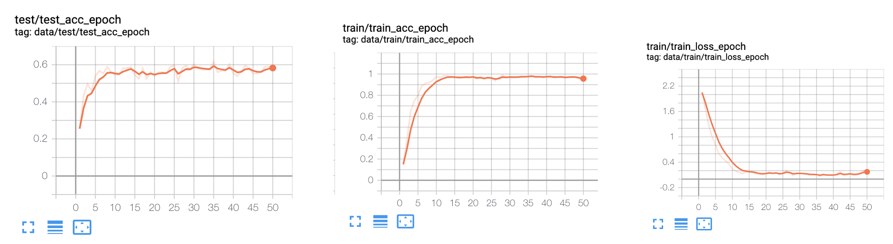

### Dataset

[baidu cloud](https://pan.baidu.com/s/1iDClwqtODylPI0Rj6yfAEQ)  pwd:tt23

#### !!!!  for better performance of context data. we simple some typical data of ECW, these data have more rich context (such as ,body pose ,interaction of other persons)

[baidu cloud](https://pan.baidu.com/s/13AZca4cAnyH70e5GkkG83w)  pwd:l7wu



we assume that:

Interaction : the face or mutual information of others in videos, it can be improve FER.

body : the posture movement of  labeld peroson , it can be improve FER.

other: other background info except for the above two cases.


because the data has some noise ,such as landmark in diff person、bad data , and also should change to standard format ,so dowload the data in your path ,and set the path in   **config.py **  

the  Class Dataset_Config 's method :Get_path, change the name 'ours' to your path which you put the ECW data.

and then run :

```
python dataloader/Unify_Dataloader.py
```

or  you just need run 

```
sh genderate_data.sh
```

as a result is , you will get a split data in your saved path where you set in config.py


### Train

set the options which you want  in get_common_config of config.py ,and set the model which you want to train in Unify-Trainer.py

as example,

you can set the hyper-param of model in config.py , and then set the correspond model name in  Unify-Trainer.py line 52. 

and then.

```
python Unify-Trainer.py
```

it will be work.


as the result, you can see the res of train. 

1. the confusion matrix in Result/Confusion_matrix dir
2. the train log and tensorboard in  ./log


the more standard arch will be release some days later.


### Res

acc of refined dataset:



confusion matrix (refined data):





